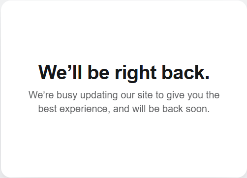
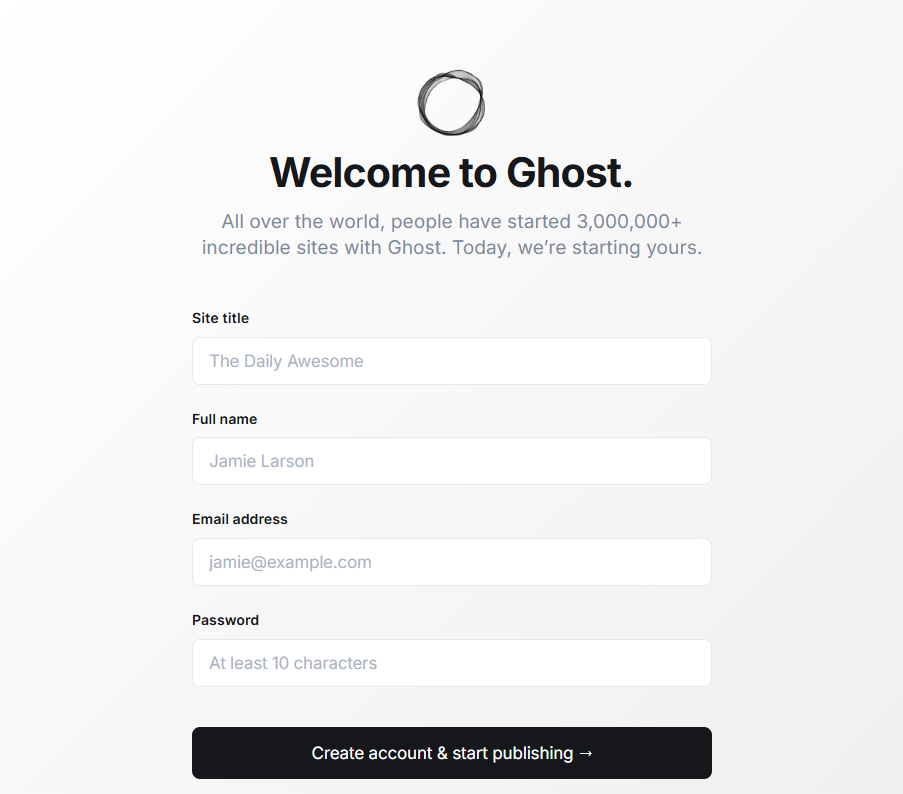

# AlfaNotes
by Marcus Zou


## Table of Contents

- [Intro](#intro)
- [The Enterprise-Production Edition: mariadb, mysql based](#the-enterprise-production-edition-mariadb-mysql-based)
- [Running up the docker](#running-up-the-docker)
- [Trouble-shooting](#trouble-shooting)
- [Trouble-shooting mysql 8](#trouble-shooting-mysql-8)
- [The Lite-Development Edition: sqlite3 based](#the-lite-development-edition-sqlite3-based)
- [Enjoy the show](#enjoy-the-show)
- [Pullover the webapp](#pullover-the-webapp)
- [Outro](#Outro)
- [License](#License)


## Intro

This is the Alfa-Notes WebApp utilizing the best open-sourced blogging platform of https://ghost.org. 

Let's roll up sleeves and get hands dirty.

1- Create folders

```shell
## create project folder
mkdir alfanotes && cd alfanotes
## make sub-folders
mkdir -p assets db content
```

2- Select database: A simple way is to use the file based sqlite3 for small loading projects; but production-ready database shall be MySQL 8.x or MariaDB 11.x, even a PostgreSQL instance.


## The Enterprise-Production Edition: mariadb, mysql based

#### Feature

1. Based on **mariadb 11.4** or **mysql 8.4**, great for enterprise/big project
2. Stable and popular database engine 
3. The initialization of the `mariadb` database+ghost blog takes only **1+3 minutes**, way faster than `mysql`. 


#### The `yaml` file

The contents of the `docker-compose.yaml` shall be like below (**mariadb** preferred):

```textfile
services:
  ghost:
    image: ghost:6-alpine
    container_name: anotes-ctnr
    restart: always
    ports:
      - 2368:2368
    depends_on:
      - dbsvr
    environment:
      database__client: mysql
      database__connection__host: dbsvr
      database__connection__user: zenusr
      database__connection__password: strongPass!2024
      database__connection__database: anotes
      url: http://localhost:2368
      # NODE_ENV: production
    volumes:
      - ./content:/var/lib/ghost/content

  dbsvr:
    image: mariadb:11.4
    container_name: anotes-db-ctnr
    restart: always
    environment:
      MYSQL_ROOT_PASSWORD: superStrong!2024
      MYSQL_USER: zenusr
      MYSQL_PASSWORD: strongPass!2024
      MYSQL_DATABASE: anotes
    volumes:
      - ./db:/var/lib/mysql
      - ./env/init.sql:/docker-entrypoint-initdb.d/init.sql

volumes:
  content:
  db:
```

Quite a lot of time that many geeks get stuck at a unstable docker of the main container: __anotes__. Please check out the tips below:

> [!TIP]
>
> Please ensure running up the containers with these values:
>
> - `database__client` must be set to `mysql` whatever your database is mysql 8.x or mariadb 8.x - 11.x, even 14.x.
> - `database__connection__host` should reference to the **service name** (not the container) of your database.
> - `MYSQL_DATABASE` and `database__connection__database` need to be the same values.
> - `MYSQL_USER` and `database__connection__user` need to be the same values.
> - `MYSQL_PASSWORD` and `database__connection__password` need to be the same values.
>
> Otherwise you will suffer from an issue of `ERROR Invalid database host`.

> [!TIP]
>
> The **mysql** is more picky than **mariadb**, then please ensure this is no file in __db__ folder prior to mounting and starting.

For mariaDB, we need to initialize the database by transferring in an `init.sql` :

```shell
    volumes:
      - ./db:/var/lib/mysql
      - ./env/init.sql:/docker-entrypoint-initdb.d/init.sql
```

And the contents of the very `init.sql` be like:

```shell
CREATE DATABASE IF NOT EXISTS anotes;

CREATE USER IF NOT EXISTS 'zenusr'@'%' IDENTIFIED BY 'strongPass!2024';

GRANT ALL PRIVILEGES ON *.* TO 'zenusr'@'%' WITH GRANT OPTION;
GRANT SELECT ON anotes.* TO 'zenusr'@'%' WITH GRANT OPTION;

FLUSH PRIVILEGES;
```


## Running up the docker

```shell
docker compose up -d  
## If running up a sepecific ymal file, please do
## docker compose -f docker-compose-prod-mariadb.yaml up -d
```

Open a browser with a link: http://localhost:2368 for the website. you shall receive a output like:



> [!IMPORTANT]
>
> It takes __3~5 minutes__ (It is a very long time) to initialize the __mariadb__ database and configure the default Ghost Blog engine, then be patient.

> [!CAUTION]
>
> It takes __24 minutes__ to finish off the entire process using __mysql 8.0__ database, on my Dell Precision 7820 Tower monster (48 CPU cores, 256GB RAM, SATA HDD though), then be PATIENT!

Once you see a message of "__Explore Response 200 OK__", the webapp screen shall be like:


You are good to go for the `setup` page: http://localhost:2368/ghost, which will bring up a screen of:




## Trouble-shooting

There might be problematic when running up the containers.

1- A very good command knowing if the main container, __anotes__, is up running or not can be conducted as below:

```shell
docker logs anotes
```

At first, the logs may indicate the main container is shutting down, etc. but wait for a moment and try this command again. 

2- Sometime, the __db__ folder does not have any files mounted, while the __content__ folder got mounted very well. then the issue is definitely related to the database server. then, run the command below to diagnose the database server:

```shell
docker logs anotes-db
```

3- The more often issue of the database container, __anotes-db__, is the container is broken. then launch a command:

```shell
docker exec -it anotes-db bash
```

Then run a command to login to the mysql/mariadb instance:

```shell
mysql -u zenusr -p
## You have to type in the strongPass!2024 as password 
```

Once connected, you can check out if a database instance is in place or not:

```shell
SHOW DATABASES;
```

Press "exit" to quit the session.


## Trouble-shooting mysql 8

While `mariadb` is so great, the `mysql 8.x` could introduces a lot of issues:

#### `mysql` 8.0

1. The typical issue is the docker has no writing privilege to bind-mount against a local folder; then please remove such mounting (the `VOLUMES` section inside the database container), but using `docker logs <db-container>` command to check up. This will avoid 95% of the issue, pretty sure!
2. The initialization of database and ghost blog system takes around **20-30 minutes**, then be patient.

#### `mysql` 8.4

1. The typical issue is the docker has no writing privilege to bind-mount against a local folder or `mysql_ssl_rsa_setup: Can't change permissions of the file 'ca-key.pem'`, that's due to the Linux environment inside the Docker container (and WSL2's Linux VM) may have difficulty interpreting or modifying permissions on files originating from a Windows NTFS filesystem. This can lead to the "**Operation not permitted**" error when `mysqld` tries to set specific permissions for its sensitive files like `ca.pem`

2. Solution: 

   Remove such mounting (the `VOLUMES` section inside the database container). This will avoid 95% of the issue, pretty sure! 

   The initialization of the database+ghost blog takes around **3+8 minutes**, that's way faster than `mysql 8.0`, then be patient.

3. Check up the database container: Run the command below to check out what's going on:

   ```shell
   docker logs anotes-db
   ```

   you should have the following output:

   > [!IMPORTANT]
   >
   > 2025-11-04 08:10:11+00:00 [Note] [Entrypoint]: Entrypoint script for MySQL Server 8.4.7-1.el9 started.
   > 2025-11-04 08:10:18+00:00 [Note] [Entrypoint]: Switching to dedicated user 'mysql'
   > 2025-11-04 08:10:18+00:00 [Note] [Entrypoint]: Entrypoint script for MySQL Server 8.4.7-1.el9 started.
   > 2025-11-04 08:10:19+00:00 [Note] [Entrypoint]: Initializing database files
   > 2025-11-04T08:10:19.242117Z 0 [System] [MY-015017] [Server] MySQL Server Initialization - start.
   > 2025-11-04T08:10:19.282333Z 0 [System] [MY-013169] [Server] /usr/sbin/mysqld (mysqld 8.4.7) initializing of server in progress as process 80
   > 2025-11-04T08:10:19.714300Z 1 [System] [MY-013576] [InnoDB] InnoDB initialization has started.
   > 2025-11-04T08:10:33.858269Z 1 [System] [MY-013577] [InnoDB] InnoDB initialization has ended.
   > 2025-11-04T08:11:25.124944Z 6 [Warning] [MY-010453] [Server] root@localhost is created with an empty password ! Please consider switching off the --initialize-insecure option.
   > 2025-11-04T08:12:30.359511Z 0 [System] [MY-015018] [Server] MySQL Server Initialization - end.
   > 2025-11-04 08:12:30+00:00 [Note] [Entrypoint]: Database files initialized
   > 2025-11-04 08:12:30+00:00 [Note] [Entrypoint]: Starting temporary server
   > 2025-11-04T08:12:30.562979Z 0 [System] [MY-015015] [Server] MySQL Server - start.
   > 2025-11-04T08:12:30.960582Z 0 [System] [MY-010116] [Server] /usr/sbin/mysqld (mysqld 8.4.7) starting as process 144
   > 2025-11-04T08:12:31.749670Z 1 [System] [MY-013576] [InnoDB] InnoDB initialization has started.
   > 2025-11-04T08:12:44.437143Z 1 [System] [MY-013577] [InnoDB] InnoDB initialization has ended.
   > 2025-11-04T08:12:51.785701Z 0 [Warning] [MY-010068] [Server] CA certificate ca.pem is self signed.
   > 2025-11-04T08:12:51.785949Z 0 [System] [MY-013602] [Server] Channel mysql_main configured to support TLS. Encrypted connections are now supported for this channel.
   > 2025-11-04T08:12:51.877373Z 0 [Warning] [MY-011810] [Server] Insecure configuration for --pid-file: Location '/var/run/mysqld' in the path is accessible to all OS users. Consider choosing a different directory.
   > 2025-11-04T08:12:52.025835Z 0 [System] [MY-011323] [Server] X Plugin ready for connections. Socket: /var/run/mysqld/mysqlx.sock
   > 2025-11-04T08:12:52.025966Z 0 [System] [MY-010931] [Server] /usr/sbin/mysqld: ready for connections. Version: '8.4.7'  socket: '/var/run/mysqld/mysqld.sock'  port: 0  MySQL Community Server - GPL.
   > 2025-11-04 08:12:52+00:00 [Note] [Entrypoint]: Temporary server started.
   > '/var/lib/mysql/mysql.sock' -> '/var/run/mysqld/mysqld.sock'
   > Warning: Unable to load '/usr/share/zoneinfo/iso3166.tab' as time zone. Skipping it.
   > Warning: Unable to load '/usr/share/zoneinfo/leap-seconds.list' as time zone. Skipping it.
   > Warning: Unable to load '/usr/share/zoneinfo/leapseconds' as time zone. Skipping it.
   > Warning: Unable to load '/usr/share/zoneinfo/tzdata.zi' as time zone. Skipping it.
   > Warning: Unable to load '/usr/share/zoneinfo/zone.tab' as time zone. Skipping it.
   > Warning: Unable to load '/usr/share/zoneinfo/zone1970.tab' as time zone. Skipping it.
   > 2025-11-04 08:13:21+00:00 [Note] [Entrypoint]: Creating database anotes
   > 2025-11-04 08:13:23+00:00 [Note] [Entrypoint]: Creating user zenusr
   > 2025-11-04 08:13:23+00:00 [Note] [Entrypoint]: Giving user zenusr access to schema anotes
   >
   > 2025-11-04 08:13:23+00:00 [Note] [Entrypoint]: Stopping temporary server
   > 2025-11-04T08:13:24.084753Z 13 [System] [MY-013172] [Server] Received SHUTDOWN from user root. Shutting down mysqld (Version: 8.4.7).
   > 2025-11-04T08:13:30.037876Z 0 [System] [MY-010910] [Server] /usr/sbin/mysqld: Shutdown complete (mysqld 8.4.7)  MySQL Community Server - GPL.
   > 2025-11-04T08:13:30.037956Z 0 [System] [MY-015016] [Server] MySQL Server - end.
   > 2025-11-04 08:13:30+00:00 [Note] [Entrypoint]: Temporary server stopped
   >
   > 2025-11-04 08:13:30+00:00 [Note] [Entrypoint]: MySQL init process done. Ready for start up.
   >
   > 2025-11-04T08:13:31.227531Z 0 [System] [MY-015015] [Server] MySQL Server - start.
   > 2025-11-04T08:13:31.722439Z 0 [System] [MY-010116] [Server] /usr/sbin/mysqld (mysqld 8.4.7) starting as process 1
   > 2025-11-04T08:13:32.143788Z 1 [System] [MY-013576] [InnoDB] InnoDB initialization has started.
   > 2025-11-04T08:13:46.097850Z 1 [System] [MY-013577] [InnoDB] InnoDB initialization has ended.
   > 2025-11-04T08:13:50.225848Z 0 [Warning] [MY-010068] [Server] CA certificate ca.pem is self signed.
   > 2025-11-04T08:13:50.226061Z 0 [System] [MY-013602] [Server] Channel mysql_main configured to support TLS. Encrypted connections are now supported for this channel.
   > 2025-11-04T08:13:50.387960Z 0 [Warning] [MY-011810] [Server] Insecure configuration for --pid-file: Location '/var/run/mysqld' in the path is accessible to all OS users. Consider choosing a different directory.
   > 2025-11-04T08:13:50.704709Z 0 [System] [MY-011323] [Server] X Plugin ready for connections. Bind-address: '::' port: 33060, socket: /var/run/mysqld/mysqlx.sock
   > 2025-11-04T08:13:50.705235Z 0 [System] [MY-010931] [Server] /usr/sbin/mysqld: ready for connections. Version: '8.4.7'  socket: '/var/run/mysqld/mysqld.sock'  port: 3306  MySQL Community Server - GPL.

   

4. Check up the ghost blog container: Run the command below to check out what's going on: 

   ```shell
   docker logs anotes
   ```

   You shall have the following outputs: 

   > [!NOTE]
   >
   > [2025-11-04 08:12:47] WARN Ghost is shutting down
   > [2025-11-04 08:12:47] WARN Ghost has shut down
   > [2025-11-04 08:12:47] WARN Your site is now offline
   > [2025-11-04 08:12:47] WARN Ghost was running for a few seconds
   > [2025-11-04 08:13:52] INFO Ghost is running in production...
   > [2025-11-04 08:13:52] INFO Your site is now available on http://localhost:2368/
   > [2025-11-04 08:13:52] INFO Ctrl+C to shut down
   > [2025-11-04 08:13:52] INFO Ghost server started in 20.353s
   > [2025-11-04 08:13:55] WARN Database state requires initialisation.
   > [2025-11-04 08:14:02] INFO Creating table: newsletters
   > [2025-11-04 08:14:05] INFO Creating table: posts
   > [2025-11-04 08:14:14] INFO Creating table: posts_meta
   > [2025-11-04 08:14:19] INFO Creating table: users
   > [2025-11-04 08:14:21] INFO Creating table: posts_authors
   > [2025-11-04 08:14:28] INFO Creating table: roles
   > [2025-11-04 08:14:30] INFO Creating table: roles_users
   > [2025-11-04 08:14:31] INFO Creating table: permissions
   > [2025-11-04 08:14:33] INFO Creating table: permissions_users
   > [2025-11-04 08:14:34] INFO Creating table: permissions_roles
   > [2025-11-04 08:14:35] INFO Creating table: settings
   > [2025-11-04 08:14:37] INFO Creating table: tags
   > [2025-11-04 08:14:39] INFO Creating table: posts_tags
   > [2025-11-04 08:14:48] INFO Creating table: invites
   > [2025-11-04 08:14:50] INFO Creating table: brute
   > [2025-11-04 08:14:51] INFO Creating table: sessions
   > [2025-11-04 08:14:53] INFO Creating table: integrations
   > [2025-11-04 08:14:54] INFO Creating table: webhooks
   > [2025-11-04 08:14:58] INFO Creating table: api_keys
   > [2025-11-04 08:15:00] INFO Creating table: mobiledoc_revisions
   > [2025-11-04 08:15:02] INFO Creating table: post_revisions
   > [2025-11-04 08:15:06] INFO Creating table: members
   > [2025-11-04 08:15:11] INFO Creating table: products
   > [2025-11-04 08:15:13] INFO Creating table: offers
   > [2025-11-04 08:15:21] INFO Creating table: benefits
   > [2025-11-04 08:15:23] INFO Creating table: products_benefits
   > [2025-11-04 08:15:31] INFO Creating table: members_products
   > [2025-11-04 08:15:39] INFO Creating table: posts_products
   > [2025-11-04 08:15:46] INFO Creating table: members_created_events
   > [2025-11-04 08:15:52] INFO Creating table: members_cancel_events
   > [2025-11-04 08:15:59] INFO Creating table: members_payment_events
   > [2025-11-04 08:16:04] INFO Creating table: members_login_events
   > [2025-11-04 08:16:09] INFO Creating table: members_email_change_events
   > [2025-11-04 08:16:14] INFO Creating table: members_status_events
   > [2025-11-04 08:16:19] INFO Creating table: members_product_events
   > [2025-11-04 08:16:27] INFO Creating table: members_paid_subscription_events
   > [2025-11-04 08:16:32] INFO Creating table: labels
   > [2025-11-04 08:16:35] INFO Creating table: members_labels
   > [2025-11-04 08:16:44] INFO Creating table: members_stripe_customers
   > [2025-11-04 08:16:49] INFO Creating table: subscriptions
   > [2025-11-04 08:17:02] INFO Creating table: members_stripe_customers_subscriptions
   > [2025-11-04 08:17:17] INFO Creating table: members_subscription_created_events
   > [2025-11-04 08:17:27] INFO Creating table: offer_redemptions
   > [2025-11-04 08:17:40] INFO Creating table: members_subscribe_events
   > [2025-11-04 08:17:51] INFO Creating table: donation_payment_events
   > [2025-11-04 08:17:55] INFO Creating table: stripe_products
   > [2025-11-04 08:18:01] INFO Creating table: stripe_prices
   > [2025-11-04 08:18:08] INFO Creating table: actions
   > [2025-11-04 08:18:09] INFO Creating table: emails
   > [2025-11-04 08:18:16] INFO Creating table: email_batches
   > [2025-11-04 08:18:21] INFO Creating table: email_recipients
   > [2025-11-04 08:18:35] INFO Creating table: email_recipient_failures
   > [2025-11-04 08:18:43] INFO Creating table: tokens
   > [2025-11-04 08:18:46] INFO Creating table: snippets
   > [2025-11-04 08:18:48] INFO Creating table: custom_theme_settings
   > [2025-11-04 08:18:50] INFO Creating table: members_newsletters
   > [2025-11-04 08:18:59] INFO Creating table: comments
   > [2025-11-04 08:19:14] INFO Creating table: comment_likes
   > [2025-11-04 08:19:22] INFO Creating table: comment_reports
   > [2025-11-04 08:19:30] INFO Creating table: jobs
   > [2025-11-04 08:19:32] INFO Creating table: redirects
   > [2025-11-04 08:19:38] INFO Creating table: members_click_events
   > [2025-11-04 08:19:45] INFO Creating table: members_feedback
   > [2025-11-04 08:19:53] INFO Creating table: suppressions
   > [2025-11-04 08:19:59] INFO Creating table: email_spam_complaint_events
   > [2025-11-04 08:20:12] INFO Creating table: mentions
   > [2025-11-04 08:20:14] INFO Creating table: milestones
   > [2025-11-04 08:20:15] INFO Creating table: collections
   > [2025-11-04 08:20:17] INFO Creating table: collections_posts
   > [2025-11-04 08:20:26] INFO Creating table: recommendations
   > [2025-11-04 08:20:27] INFO Creating table: recommendation_click_events
   > [2025-11-04 08:20:36] INFO Creating table: recommendation_subscribe_events
   > [2025-11-04 08:20:49] INFO Model: Collection
   > [2025-11-04 08:20:49] INFO Model: Product
   > [2025-11-04 08:20:50] INFO Model: Newsletter
   > [2025-11-04 08:20:50] INFO Model: Tag
   > [2025-11-04 08:20:50] INFO Model: Permission
   > [2025-11-04 08:20:50] INFO Model: Post
   > [2025-11-04 08:20:55] INFO Model: Integration
   > [2025-11-04 08:20:55] INFO Relation: Role to Permission
   > [2025-11-04 08:20:57] INFO Relation: Post to Tag
   > [2025-11-04 08:20:59] INFO Database is in a ready state.
   > [2025-11-04 08:20:59] INFO Ghost database ready in 447.833s
   > [2025-11-04 08:21:00] INFO Configured site_uuid was not found or invalid. Setting site_uuid to a new value: 7f724c71-9c4a-4090-98ba-760509fa24a4
   > [2025-11-04 08:21:01] WARN Missing mail.from config, falling back to a generated email address. Please update your config file and set a valid from address
   > [2025-11-04 08:21:11] INFO Invalidating assets for regeneration
   > [2025-11-04 08:21:18] INFO Adding offloaded job to the inline job queue
   > [2025-11-04 08:21:18] INFO Scheduling job mentions-email-report at 11 6 * * * *. Next run on: Tue Nov 04 2025 09:06:11 GMT+0000 (Coordinated Universal Time)
   > [2025-11-04 08:21:21] INFO URL Service ready in 16083ms
   > [2025-11-04 08:21:21] INFO Pinging Explore with Payload https://explore.ghost.org/api/update {"ghost":"6.5.3","site_uuid":"7f724c71-9c4a-4090-98ba-760509fa24a4","url":"http://localhost:2368","theme":"source","facebook":"ghost","twitter":"@ghost","posts_total":2,"posts_last":"2025-11-04T08:20:51.000Z","posts_first":"2025-11-04T08:20:50.000Z"}
   > [2025-11-04 08:21:22] INFO Adding one-off job to inlineQueue with current length = 0 called 'members-migrations'
   > [2025-11-04 08:21:22] INFO Stripe not configured - skipping migrations
   > [2025-11-04 08:21:22] INFO Explore Response 200 OK
   > [2025-11-04 08:21:22] INFO Adding offloaded job to the inline job queue
   > [2025-11-04 08:21:22] INFO Scheduling job clean-expired-comped at 44 50 5 * * *. Next run on: Wed Nov 05 2025 05:50:44 GMT+0000 (Coordinated Universal Time)
   > [2025-11-04 08:21:22] INFO Adding offloaded job to the inline job queue
   > [2025-11-04 08:21:22] INFO Scheduling job clean-tokens at 38 7 18 * * *. Next run on: Tue Nov 04 2025 18:07:38 GMT+0000 (Coordinated Universal Time)
   > [2025-11-04 08:21:22] INFO Ghost booted in 470.717s

   

5. In case that you persist bind-mounting the `/var/lib/mysql` folder from the container to the host, 

6. Solution:

   1. Mount a docker volume, instead of a folder/volume on the host. Basically change

      ```shell
      volumes:
        - ./db:/var/lib/mysql
      ```

      to 

      ```shell
      volumes:
        - db:/var/lib/mysql
      ```

      As you know, the first setting is to mount the `/var/lib/mysql` from the container to a folder `db` on the host. and the second case represents to mount the same `/var/lib/mysql` from the container to an internal folder `db` on the container. that makes huge difference.

   2. If you are using WSL2 Linux, please change the WSL2 Metadata by entering the following into `/etc/wsl.conf` within the WSL2 instance:

      ```shell
      [automount]
      options = "metadata,umask=22,fmask=11"
      ```

      After modifying, run `wsl --shutdown` and restart your WSL2 instance.


## The Lite-Development Edition: sqlite3 based

#### Features

1. Light-weight, using the `sqlite3` database (a single file) 

2. Fast and great fit for small-sized development project and test-out


#### The `yaml` file
The `docker-compose.yml` can be referred as below

```textfile
services:
  ghost:
    image: ghost:6-alpine
    container_name: anotes
    restart: always
    ports:
      - 2368:2368
    environment:
      database__client: sqlite3
      database__connection__filename: /var/lib/ghost/content/data/anotes-dev.db
      url: http://localhost:2368
      # NODE_ENV: development
    volumes:
      - ./content:/var/lib/ghost/content/
      - ./db-dev:/var/lib/ghost/content/data/

volumes:
  content:
  db-dev:
```

#### Running up the docker

```shell
docker-compose up -d  
## If running up a sepecific ymal file, please do
## docker compose -f docker-compose-dev-sqlite3.yaml up -d
```


## Enjoy the show

Finally open a browser, and type: http://localhost:2368 for the website.
First time? Please go to: http://localhost:2368/ghost for the admin page.


## Pullover the webapp

Using `docker compose down` command:

```shell
docker compose down --remove-orphans
```


As simple as below:

```shell
# Take down the 2 containers
docker stop $(docker ps -q)
docker rm $(docker ps -aq)
docker ps  ## there is no such 2 containers any more

# Remove the images
docker image rm $(docker images -q)
docker images  ## there is no such 2 images any more
```


## Outro

You may go to https://ghost.org/ for more details.


## License

MIT
